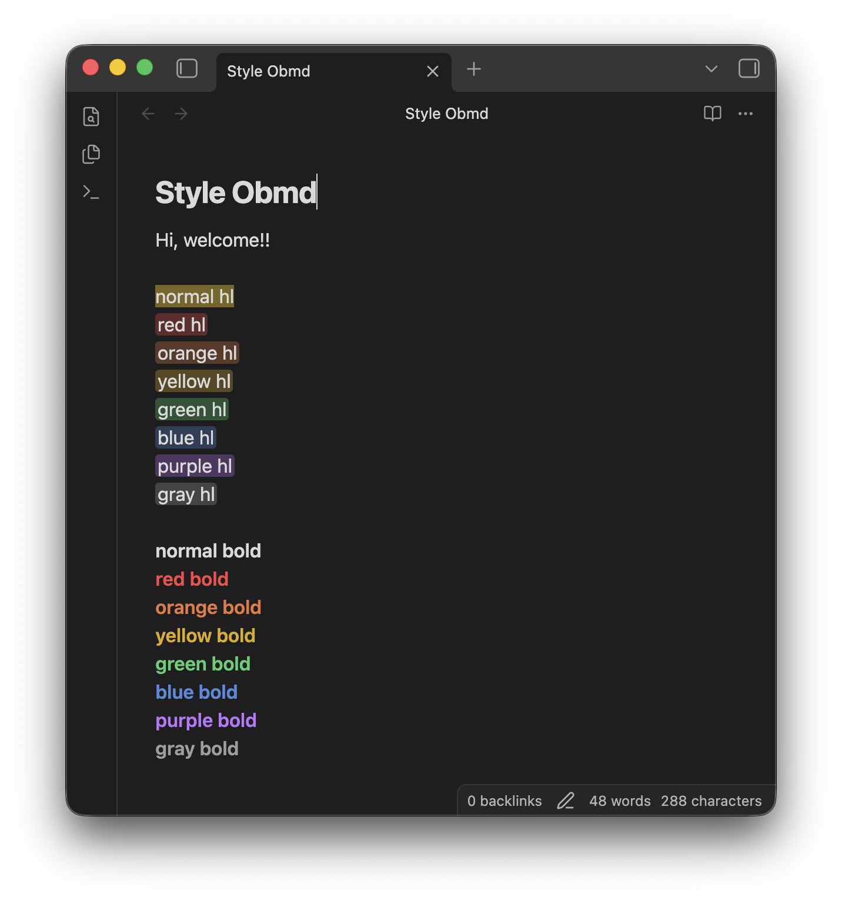

# Style Obmd for Obsidian

[English](README.md) | [繁體中文](README.zh-TW.md)

一款簡單的 Obsidian 外掛，為 <mark>螢光筆標記</mark> 與 <strong style="color: #fb4646;">粗體文字</strong> 加入 ***可自訂的顏色***，並提供將樣式 Markdown 轉換成可攜式 inline HTML 的命令。

只要在 Obsidian 內建的 Markdown 螢光筆或粗體語法中加入 `{key}` 即可。即使解除安裝此外掛，文字仍會透過標準 Obsidian Markdown 語法保留螢光筆或粗體格式。

如果有將筆記發布為網頁的需求，轉換命令可將標記轉換成 HTML 標籤，以保留這些樣式。

Demo:
 _(Example visualization)_

## 功能

- **彩色螢光筆標記**：在標準螢光筆標記語法中加入 `{顏色}`，例如 `=={r}紅色螢光筆==`。
- **彩色粗體文字**：在標準粗體語法中加入 `{顏色}`，例如 `**{b}藍色文字**`。
- **即時預覽與閱讀模式**：在編輯和閱讀筆記時直接顯示顏色。
- 設定：
  - **裝飾樣式（選用）**：為螢光筆標記加入水平 padding 與圓角（我的喜好😀）。
  - **自訂顏色**：可在外掛設定頁面中調整紅、橘、黃、綠、藍、紫、灰七種顏色。
- 命令：
  - **HTML 轉換**：將目前筆記或整個儲存庫中的 Style Obmd 標記轉換成帶有 inline style 的 HTML 標籤。

## 使用方式

在大括號中使用以下任一顏色代碼：

| 顏色 | 代碼 | 螢光筆標記範例 | 粗體範例 |
| :--- | :--- | :----------- | :------- |
| 紅色 | `{r}` | `=={r}紅色標記==` | `**{r}紅色文字**` |
| 橘色 | `{o}` | `=={o}橘色標記==` | `**{o}橘色文字**` |
| 黃色 | `{y}` | `=={y}黃色標記==` | `**{y}黃色文字**` |
| 綠色 | `{g}` | `=={g}綠色標記==` | `**{g}綠色文字**` |
| 藍色 | `{b}` | `=={b}藍色標記==` | `**{b}藍色文字**` |
| 紫色 | `{p}` | `=={p}紫色標記==` | `**{p}紫色文字**` |
| 灰色 | `{gray}` | `=={gray}灰色標記==` | `**{gray}灰色文字**` |

## 設定

你可以在 **設定 → Style Obmd** 中調整以下選項：

| 設定 | 說明 | 預設值 |
| :--- | :--- | :----- |
| **Highlight decoration** | 為螢光筆標記及匯出的 HTML 加入水平 padding 與圓角（我的喜好😀）。 | 開啟 |
| **Red** | `{r}` 標記使用的顏色。 | `#fb4646` |
| **Orange** | `{o}` 標記使用的顏色。 | `#e9783f` |
| **Yellow** | `{y}` 標記使用的顏色。 | `#e0ac00` |
| **Green** | `{g}` 標記使用的顏色。 | `#44cf6e` |
| **Blue** | `{b}` 標記使用的顏色。 | `#5389df` |
| **Purple** | `{p}` 標記使用的顏色。 | `#be75ff` |
| **Gray** | `{gray}` 標記使用的顏色。 | `#9e9e9e` |
| **Reset colors** | 將所有標記顏色恢復為預設值。 | — |

每個自訂顏色會以完整不透明度套用於粗體文字，並以 30% 不透明度套用於螢光筆標記背景。

## 命令

開啟命令面板並執行以下命令：

| 命令 | 說明 |
| :--- | :--- |
| **Style Obmd: Convert current note styles to HTML** | 將目前筆記中的所有 Style Obmd 標記轉換成 inline HTML。 |
| **Style Obmd: Convert all vault styles to HTML** | 將儲存庫內所有 Markdown 檔案中的 Style Obmd 標記轉換成 inline HTML。 |

轉換命令會略過 fenced code block 與 inline code。

⚠️ 整個儲存庫的轉換命令（**Style Obmd: Convert all vault styles to HTML**）會修改多個檔案，無法從單一編輯器歷史紀錄中復原。執行前請先備份或 commit 你的儲存庫。

## 安裝

### 從第三方外掛安裝

_(外掛審核通過後適用)_

1. 開啟 **設定 → 第三方外掛**。
2. 關閉 **受限模式**。
3. 選擇 **瀏覽** 並搜尋 `Style Obmd`。
4. 選擇 **安裝**，然後選擇 **啟用**。

### 手動安裝

1. 前往 [Releases](https://github.com/penyt/style-obmd/releases) 頁面。
2. 從最新版本下載 `main.js`、`manifest.json` 和 `styles.css`。
3. 在儲存庫的外掛資料夾中建立名為 `style-obmd` 的資料夾：`<Vault>/.obsidian/plugins/style-obmd`。
4. 將下載的檔案移至該資料夾。
5. 重新載入 Obsidian，然後在 **設定 → 第三方外掛** 中啟用此外掛。

## 授權

[MIT](LICENSE)

## 抖內

如果此外掛對你有幫助，歡迎給我一顆 GitHub star ⭐️，或 buy me a coffee ☕️！

